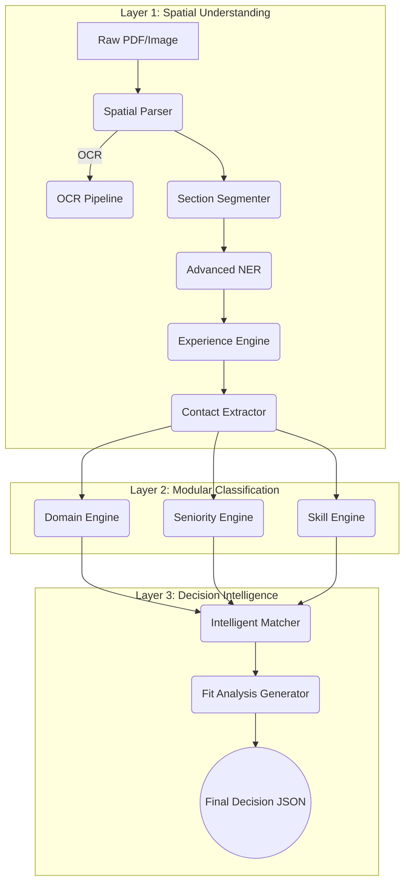

# 🧠 AI CV Analyzer (Core Matchmaking Engine)

> **V3.5 AI Pipeline — The 3-Layer Decision Intelligence Architecture**  
> **Layer 1 — Spatial Understanding:** Universal extraction with spatial normalization, semantic segmentation, and temporal parsing.  
> **Layer 2 — Modular Classification:** Specialist engines for Domain (BERT), Seniority (Hybrid), and Skill Categorization.  
> **Layer 3 — Intelligent Matchmaking:** Semantic similarity + Constraint validation + Human-readable Fit Analysis.

A **state-of-the-art 3-layer AI pipeline** that converts raw CV files into structured decision-ready intelligence, enabling high-precision candidate matching against complex Job Descriptions.



---

## 🚀 Key Innovation: Data-Driven Intelligence
Unlike hardcoded ATS systems, our pipeline is **fully decoupled from its business logic**. All keywords, taxonomies, and rules are stored in externalized `config.json` files within each layer, allowing for instant tuning without code changes.

- **Layer 1 Config**: Headers, blacklists, and location rejection filters.
- **Layer 2 Taxonomy**: Industry domains, tech clusters, and seniority action verbs.
- **Layer 3 Config**: Weights for matchmaking components (Semantic vs. Skills vs. Domain).

---

## 📂 Project Structure

```
ai-cv-analyzer/
│
├── core/                            
│   ├── layer1_understanding/         # Spatial & Semantic Extraction
│   │   ├── data/config.json          # Layer 1 rules & headers
│   │   ├── section_segmenter.py      # Multi-stage segmentation (Exact -> Regex -> Semantic)
│   │   ├── contact_extractor.py      # Improved LinkedIn & Location detection
│   │   └── ...
│   │
│   ├── layer2_classification/        # Professional Profiling
│   │   ├── data/taxonomy.json        # Unified domain & skill clusters
│   │   ├── domain_engine.py          # BERT-based industry classification
│   │   ├── seniority_engine.py       # Years-of-experience + Action-verb logic
│   │   └── skill_engine.py           # Hard/Soft skill clustering
│   │
│   └── layer3_matching/              # Decision Making
│       ├── similarity.py             # Intelligent Matcher (Multi-factor scoring)
│       ├── fit_analysis_generator.py # Generates human-readable recruitment insights
│       └── job_description_engine.py # Structured JD parsing
│
├── tests/                            # Deep Trace artifacts & test data
├── trace_cv.py                       # CLI Tool for full end-to-end deep tracing
└── main.py                           # FastAPI Production Gateway
```

---

## Table of Contents

1. [V3.5 AI Pipeline Architecture](#v35-ai-pipeline-architecture)
2. [Directory Structure](#directory-structure)
3. [6-Stage V3 Pipeline (Layer 1)](#6-stage-v3-pipeline-layer-1)
4. [Pydantic CVParseResult Schema](#pydantic-cvparseresult-schema)
5. [Layer 2 & 3](#layer-2--3)
6. [API Endpoints](#api-endpoints)
7. [Running Locally (Port 8002)](#running-locally-port-8002)
8. [Installation](#installation)
9. [Environment Variables](#environment-variables)
10. [Troubleshooting](#troubleshooting)
11. [Integration with Hybrid Orchestrator](#integration-with-hybrid-orchestrator)

---

## V3.5 AI Pipeline Architecture

| Attribute     | Detail                                                                         |
| ------------- | ------------------------------------------------------------------------------ |
| **Language**  | Python 3.11+                                                                   |
| **Framework** | FastAPI — async REST API gateway on port **8002**                              |
| **ML Models** | `dslim/bert-base-NER`, `all-MiniLM-L6-v2`, `distilbart-mnli-12-1`              |
| **OCR Stack** | PyMuPDF (text PDFs), EasyOCR + OpenCV (scanned images)    |
| **Lifecycle** | **Singleton Pattern** — all models pre-loaded at startup                       |
| **Port**      | **8002** — explicitly isolated from ai-hybrid-orchestrator (8001)              |
| **Memory**    | ~4GB RAM on startup due to singleton model loading                             |
| **Goal**      | 100% precise spatial CV parsing with normalized, canonical skill output        |

---

## Directory Structure

```
ai-cv-analyzer/
│
├── README.md                        # This file
├── requirements.txt                 # Isolated dependencies
├── main.py                          # FastAPI sub-service gateway (port 8002)
├── .env.example                     # Environment template (GEMINI_API_KEY, HF_TOKEN, NER_MODEL_PATH)
├── .gitignore                       # Custom rules for weights, training data, test PDFs
│
├── training/                        # Training data & scripts (large files Git-ignored)
│   ├── train_ner.ipynb              # Colab notebook: synthetic data + fine-tuning
│   ├── generate_tech_dataset.py     # Gemini-powered 50K sample generator (multi-key rotation)
│   ├── clean_dataset.py             # Deduplication + entity validation + greedy SKILL filter
│   ├── check-models.py              # Lists available Gemini models for a given API key
│   ├── train_real_tech.json         # Raw generated dataset (Git-ignored, ~14 MB)
│   └── train_real_tech_cleaned.json # Cleaned dataset for training (Git-ignored, ~13 MB)
│
├── scripts/                         # Verification & deployment utilities
│   ├── verify_phase1.py             # PDF CID stripping, skill extraction, training prompt
│   ├── verify_phase2.py             # NER name extraction, skill/role/org de-confliction
│   ├── verify_phase3.py             # Date regex + total_years, description scrubbing
│   ├── verify_phase4.py             # Fine-tuned model loading, full orchestrator benchmark
│   ├── verify_phase5.py             # Singleton test, stress test (50K words), error handling
│   ├── deploy_model.py              # Quick local model deployment (no training required)
│   └── patch_nb.py                  # Programmatic notebook patching (TrainingArgs + verification cell)
│
├── tests/                           # Test scripts
│   ├── test_cv.py                   # Legacy end-to-end API test (uses old /api/v2/ paths)
│   └── test_local_model.py          # Direct model inference test (bypasses FastAPI)
│
└── docs/                            # Sub-documentation
    ├── HOW_TO_TRAIN_MODEL.md        # Step-by-step Colab training guide
    └── TESTING_GUIDE.md             # Manual & automated testing guide
```

---

## 6-Stage V3 Pipeline (Layer 1)

The V3 pipeline processes PDFs through six tightly coupled stages, producing a strict **CVParseResult** JSON schema.

### Stage 1: Spatial Normalization & OCR Fallback

| Module             | File                | Purpose                                                                 |
| ------------------ | ------------------- | ----------------------------------------------------------------------- |
| **Spatial Parser** | `spatial_parser.py` | Layout-aware PDF text extraction using **pdfplumber** word coordinates  |
| **OCR Pipeline**   | `ocr_pipeline.py`   | Fallback extraction using **EasyOCR + OpenCV**                          |

- **Row Grouper**: Clusters words by Y proximity (`y_tolerance` = median word height × 0.65)
- **Column-Aware Ordering**: Splits rows on horizontal gaps (column separation), clusters segments by X position
- **OCR Decision Logic**: Orchestrator triggers `EasyOCR` if the spatial parser fails, returns `< 150` characters, or detects `no_text`.
- **Output**: Ordered text string preserving logical reading flow (avoids multi-column chaos)

### Stage 2: Semantic Section Segmentation

| Module               | File                  | Purpose                                                         |
| -------------------- | --------------------- | --------------------------------------------------------------- |
| **Section Segmenter**| `section_segmenter.py`| Splits ordered text into 7 CV sections via multi-level heuristics |

- **Sections**: `profile_summary`, `experience`, `education`, `skills`, `projects`, `certificates`, `languages`, `uncategorized`
- **3-Level Detection**: 
  1. Exact Match (confidence 0.99)
  2. Regex Match (confidence 0.85-0.95)
  3. **Semantic Header Resolution** (Phase 3): Uses `all-MiniLM-L6-v2` embeddings to resolve unknown headers via cosine similarity against reference embeddings (confidence ≤ 0.90)
- **Output**: `SegmentationResult` with blocks, sections dict, and analysis (found/missing sections, anomalies)

### Stage 3: Advanced NER & Validation

| Module          | File             | Purpose                                                               |
| --------------- | ---------------- | --------------------------------------------------------------------- |
| **Advanced NER**| `advanced_ner.py`| BERT-based Named Entity Recognition with **overlapping chunking**     |

- **Model**: `dslim/bert-base-NER` or custom `career_compass_ner_final` if present
- **Context Window**: Configurable `context_window_words=3` — validates entities within ±3 words of surrounding tokens
- **Overlapping Chunking** (Phase 5.1): Processes long CVs in 3500-char chunks with a 500-char stride to avoid token truncation.
- **Intelligent Boundary Expansion**: Expands WordPiece token boundaries to capture full entity names (with cross-entity safety guards).
- **Quantization**: Optional INT8 dynamic quantization for CPU optimization (`NER_QUANTIZE=true`).

### Stage 4: Canonicalization

| Module           | File             | Purpose                                              |
| ---------------- | ---------------- | ---------------------------------------------------- |
| **Canonicalizer**| `canonicalizer.py`| Skill normalization via a **5-Level Resolution Chain** |

- **5-Level Resolution Chain**:
  1. **Exact Variant** (0.99)
  2. **Exact Canonical** (0.97)
  3. **RapidFuzz** (0.70-0.95, default threshold 86)
  4. **Normalized Key** (0.90)
  5. **Semantic Embedding Match** (Phase 3): Uses `all-MiniLM-L6-v2` to match unknown skills against pre-computed canonical skill embeddings (0.80-0.90)
- **Output**: `CanonicalSkill` list with `name`, `confidence_score`, `sources`, `raw_variants`

### Stage 5: Temporal Engine & Career Health

| Module             | File                 | Purpose                                           |
| ------------------ | -------------------- | ------------------------------------------------- |
| **Experience Engine** | `experience_engine.py` | Date range extraction, skill durations, and career health analysis |

- **Date Parsing**: `python-dateutil` with regex fallback for robust handling of formats.
- **Skill Duration Tracking**: Calculates accumulated years per technology by merging overlapping job intervals.
- **Career Health Analysis**: Detects **employment gaps** (>6 months), **suspicious overlaps** (>90 days), and **job hopping** (3+ roles under 1 year in the last 5 years).
- **Action Verb Scoring**: Calculates a normalized score (0.0-1.0) based on the density of 42 strong action verbs in job descriptions.
- **Seniority Inference**: Determines seniority level (`intern` to `principal`) using a weighted mix of title keywords (60%), total years (40%), and action verb micro-adjustments.

### Stage 6: Contact Information Extraction (Regex)

| Module                | File                    | Purpose                                                  |
| --------------------- | ----------------------- | -------------------------------------------------------- |
| **Contact Extractor** | `contact_extractor.py`  | Regex-based extraction of structured contact details     |

- **Email**: RFC-5321 simplified regex — picks the first match, lowercased
- **Phone**: International format support (`+20 101 234 5678`, `(02) 12345678`, `+1-800-555-0199`); minimum 7 digits to filter noise
- **LinkedIn**: Matches `linkedin.com/in/<profile>` URLs; auto-prefixes `https://` if missing
- **GitHub**: Matches `github.com/<username>` URLs; auto-prefixes `https://` if missing
- **Location**: Keyword-anchored heuristic — looks for `Location:`, `Address:`, `Based in:`, `City:`, `Residence:` labels
- **Output**: `ContactInfo` dict with keys: `email`, `phone`, `linkedin_url`, `github_url`, `location` (each `null` if undetected)

> **Note**: The orchestrator calls `extract_contacts(ordered_text)` after spatial parsing and populates the `Profile.contact` field natively, eliminating the need for downstream merging in the hybrid orchestrator.

---

## Pydantic CVParseResult Schema

The pipeline outputs a **strict Pydantic model** — `CVParseResult` — ensuring type safety and contract consistency:

```python
class StrictModel(BaseModel):
    model_config = ConfigDict(extra="forbid", str_strip_whitespace=True)

class CVParseResult(StrictModel):
    parsing_status: Literal["success", "ocr_fallback", "empty_file", "no_text", "error"]
    profile: Profile           # full_name, current_title, headline, summary, contact
    stats: DocumentStats       # page_count, char_count, word_count
    skills: SkillsSection      # items: List[SkillItem], confidence_score
    experience: ExperienceSection  # items: List[ExperienceItem], confidence_score
    analysis: AnalysisSection  # predicted_role, seniority, strengths, gaps, red_flags, metadata
```

**ContactInfo**: `email`, `phone`, `location`, `linkedin_url` (HttpUrl), `github_url` (HttpUrl), `portfolio_url` (HttpUrl) — all optional.

**SkillItem**: `name`, `confidence_score`, `category` (Literal: `hard | soft | tool | language | framework | platform | other`), `evidence` (snippet indicating where found).

**ExperienceItem**: `title`, `company`, `location`, `start_date`, `end_date`, `is_current`, `description` (list of bullet strings), `technologies`, `confidence_score`.

**AnalysisSection.seniority**: Literal enum: `intern | junior | mid | senior | lead | principal`.

---

## Layer 2 & 3

### Layer 2: Domain Classification

- **Primary Model**: `all-MiniLM-L6-v2` (Semantic Embeddings, Singleton)
- **Fallback Model**: `valhalla/distilbart-mnli-12-1` (Zero-Shot Classification)
- **Method**: The system pre-computes **Centroid Vectors** for a rich Domain Knowledge Bank. It extracts structured CV data (skills, job titles, technologies) and calculates cosine similarity against the centroids.
- **2-Stage Classification**:
  1. Matches against **12 Industry Domains** (e.g., Healthcare, Finance, Technology & Software).
  2. If the primary domain is `Technology & Software`, it runs a second pass against **9 Tech Sub-Domains** (e.g., Backend, Frontend, DevOps, Data Science).

### Layer 3: Semantic Matching Engine

- **Model**: `all-MiniLM-L6-v2` — 384-dim embeddings (Singleton)
- **Method**: Calculates an **Adaptive Seniority-Weighted Score** based on 3 components:
  1. **Contextual Similarity**: CV profile summary / experience vs. Job description embedding.
  2. **Structured Skills Similarity**: CV canonical skills vs. Job required skills (embedded).
  3. **Domain Alignment**: Layer 2 domain matching (Exact match = 1.0, semantic similarity if partial, threshold < 0.65 = 0.0).
- **Adaptive Weights**: Matching criteria changes based on the candidate's inferred seniority:

| Seniority | Semantic Context Weight | Structured Skills Weight | Domain Alignment Weight |
|---|---|---|---|
| `intern` | 30% | 60% | 10% |
| `junior` | 40% | 40% | 20% |
| `senior` | 30% | 20% | 50% |
| `lead` | 20% | 20% | 60% |
| `default` | 40% | 40% | 20% |

- **Return schema**:

```json
{
  "match_score": 85.20,
  "breakdown": {
    "contextual_similarity": 78.50,
    "structured_skills_similarity": 95.00,
    "domain_alignment": 100.00
  },
  "weights_used": {
    "semantic": 0.40,
    "skills_structured": 0.40,
    "domain": 0.20
  },
  "missing_skills": ["Kubernetes", "Terraform"],
  "detected_domains": {
    "cv": "Backend Development",
    "job": "Technology & Software"
  }
}
```

---

## API Endpoints

| Method | Endpoint         | Description                                                                     |
| ------ | ---------------- | ------------------------------------------------------------------------------- |
| `GET`  | `/`              | Health check — `{"status": "operational", "version": "v2.0 (3-Layer Architecture)"}` |
| `POST` | `/api/parse-cv`  | Upload CV (multipart) → Layer 1 (V3 pipeline) → returns strict `CVParseResult`  |
| `POST` | `/api/process_file`| Internal programmatic CLI/service interface for processing files locally      |

> **Legacy Notice**: The `/api/v2/analyze-cv` and `/api/v2/match-job` endpoints were removed during the API unification phase. Layer 3 matching is now consumed exclusively through the **ai-hybrid-orchestrator** gateway on port 8001 (see `POST /api/hybrid-match`).

---

## Running Locally (Port 8002)

```bash
cd ai-cv-analyzer
python -m venv venv

# Windows
venv\Scripts\activate

# macOS/Linux
source venv/bin/activate

pip install -r requirements.txt
python main.py   # or: uvicorn main:app --host 0.0.0.0 --port 8002 --reload
```

**Verify**: http://127.0.0.1:8002/docs (Swagger UI)

> **Port 8002** is explicitly isolated from the ai-hybrid-orchestrator (port 8001) to allow concurrent model testing and direct Laravel integration for Layer 3 matching.

---

## Installation

```bash
cd ai-cv-analyzer
python -m venv venv
venv\Scripts\activate        # Windows
source venv/bin/activate     # macOS/Linux
pip install -r requirements.txt
```

**EasyOCR** handles OCR natively for scanned PDFs and images — no separate Tesseract installation is required. EasyOCR downloads its own recognition models on first use.

> **Optional**: If you prefer using `pytesseract` directly for custom OCR pipelines, download Tesseract from [UB-Mannheim/tesseract](https://github.com/UB-Mannheim/tesseract/wiki) and add to PATH.

---

## Environment Variables

Copy the environment template and fill in your credentials:

```bash
cp .env.example .env
```

| Variable | Purpose | Required |
|---|---|---|
| `GEMINI_API_KEY` | Google Gemini API key — used by `training/generate_tech_dataset.py` for synthetic data generation | Only for training |
| `HF_TOKEN` | HuggingFace token — used for accessing gated models (if any) | Optional |
| `NER_MODEL_PATH` | Path to fine-tuned NER weights (default: `./models/ner_weights/career_compass_ner_final`) | Optional (auto-detected) |
| `NER_QUANTIZE` | Enable INT8 dynamic quantization for the NER model to save memory | Optional (default: false) |
| `EMBEDDER_QUANTIZE` | Enable INT8 dynamic quantization for the Embedder to save memory | Optional (default: false) |
| `EMBEDDER_MODEL_NAME` | Name of the SentenceTransformer to use (default: `all-MiniLM-L6-v2`) | Optional |
| `CV_TIMEOUT_SECONDS` | Maximum processing time allowed per CV | Optional (default: 30) |

---

## Troubleshooting

| Challenge                       | Solution                                                                  |
| ------------------------------- | ------------------------------------------------------------------------- |
| **Port 8002 in use**            | Ensure no legacy services run on 8002; ai-cv-analyzer is isolated         |
| **`core/` namespace collision** | Resolved in ai-hybrid-orchestrator via sequential sys.path swap           |
| **Memory overhead**             | ~4GB RAM; set `NER_QUANTIZE=true` and `EMBEDDER_QUANTIZE=true` on CPU hosts |
| **OCR resource intensity**      | PyMuPDF (fast, text-only) → EasyOCR fallback (image-based)                |
| **Timeouts on large PDFs**      | Increase `CV_TIMEOUT_SECONDS` (default is 30s)                            |

---

## Integration with Hybrid Orchestrator

`ai-cv-analyzer` is consumed by:

1. **ai-hybrid-orchestrator** — `hybrid_runner.py` and `main_api.py` import `CVOrchestrator` and `IntelligentMatcher`
2. **Laravel CvProcessingService** — calls `POST /api/parse-cv` on port 8002 for direct CV analysis

See [ai-hybrid-orchestrator/README.md](../ai-hybrid-orchestrator/README.md) for the full integration flow.

---

**Last Updated**: April 2026  
**Version**: V3 Pipeline — 6-Stage Layer 1 Understanding + Contact Extraction
