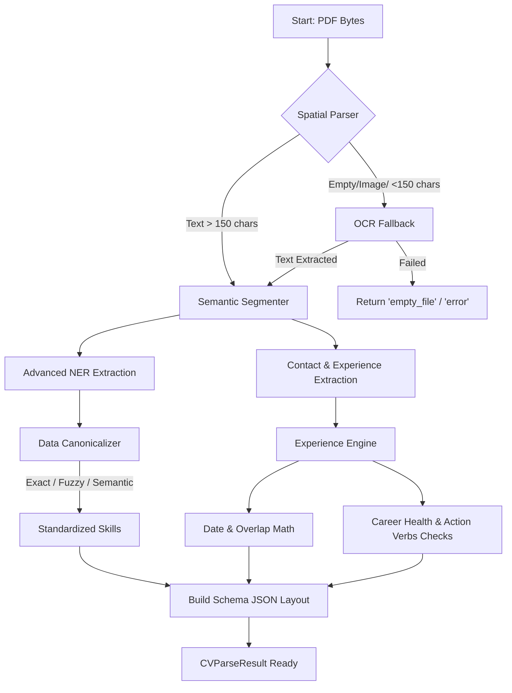

# الدليل المرجعي الشامل للطبقة الأولى (Layer 1: Understanding)

هذا الملف يمثل المرجع المعماري والبرمجي الدقيق للطبقة الأولى في مشروع **Career Compass (AI CV Analyzer)**. كل سطر ومعلومة مذكورة هنا مستخرجة حرفياً من الأكواد الموجودة في مسار `core/layer1_understanding/`، وهو مُصمم ليغطي كافة الجوانب التقنية، التسلسل المنطقي، وطرق التعامل مع الأخطاء.

---

## 🏗️ 1. تحليل مكونات وعناصر Layer 1 (Components Analysis)

تضم هذه الطبقة 8 مكونات برمجية (ملفات) تتكامل سوياً لاستخراج وبناء فهم عميق لهيكل وفحوى السيرة الذاتية.

### 1️⃣ `orchestrator.py` (المايسترو)
- **وظيفته الفردية:** واجهة الطبقة الخارجية (Facade/Entry Point). يُدير جميع الملفات الأخرى ويزامن (Synchronize) ترتيب المخرجات في نظام محكم بخطوات ثابتة.
- **التبعيات (Dependencies):** يعتمد بشكل مباشر على جميع الملفات الأخرى. ويعتمد داخلياً على `SemanticEmbedder` (من Layer 3) بشكل اختياري لمعالجة التطابق الدلالي.
- **ماذا لو فشل أو حُذف؟** ينهار النظام بالكامل، لأنه الوحيد الذي يجمع البيانات المجزأة (Skills, Experience, Contacts) ويركبها داخل قالب `CVParseResult` المعتمد في الـ API النهائي.

### 2️⃣ `spatial_parser.py` (المُحلل المكاني)
- **وظيفته:** قراءة ملف الـ PDF ككتلة إحداثيات (Coordinates). يقرأ الكلمات ويجمعها في صفوف وأعمدة عبر دوال مثل `_group_words_into_rows` بناءً على قربها المكاني لتجنب تشوه ترتيب الكلمات عند تحويل الـ PDF لنص.
- **ماذا لو فشل؟** لا تتوقف العمليات! النظام يستدعي الخطة البديلة وينتقل مباشرة ليستخدم `ocr_pipeline.py`.

### 3️⃣ `ocr_pipeline.py` (معالجة الصور والوثائق الممسوحة)
- **وظيفته:** استخراج النص من السير الذاتية التي تُرفع كصور (Scanned PDF) باستخدام مكتبة `EasyOCR` ومكتبة التعامل مع الـ PDF `PyMuPDF`.
- **الميزة الكودية:** يطبق مبدأ التهميش الاختياري (`OCR_AVAILABLE = False`). لو كانت المكتبات غير مُثبتة، يتوقف عن العمل بهدوء ويرد برسالة `empty_file` بدلاً من تحطيم السيرفر عبر `ImportError` صريح.

### 4️⃣ `section_segmenter.py` (مُمزق المقاطع الدلالي)
- **وظيفته:** تفتيت النص الكامل إلى أقسام واضحة (Profile, Experience, Skills, Education, Projects) عبر التعرف على عناوين الأقسام.
- **ماذا لو فشل في التعرف على عنوان؟** سيقوم بوضع النصوص في جزء (Uncategorized)، ولكن بفضل تحديث `_semantic_header_match` نادراً ما يفشل حالياً.

### 5️⃣ `advanced_ner.py` (محرك الكيانات اللغوية المتقدم)
- **وظيفته:** قراءة كل جزء وتصنيفه لمهارة (`skills`)، دور وظيفي (`roles`)، أو مكان (`orgs/locations`) باستخدام نماذج `Transformers`.
- **الهندسة:** مبني بنظام `Singleton` ليظل في الذاكرة (RAM) لمرة واحدة فقط. يدعم تحجيم الذاكرة الديناميكي `INT8 Dynamic Quantization` وتقنية `CPU-Safe CUDA Fallback` لمنع الانهيار.

### 6️⃣ `canonicalizer.py` (المُوَحد القياسي للبيانات)
- **وظيفته:** حل مشكلة الفوضى البشرية (مثل كتابة ReactJS و React.js) وتوحيدها للشكل الهندسي الرسمي عبر 5 فلاتر من الأقوى دقة إلى العميقة ذكاءً (Semantic Fallback).

### 7️⃣ `experience_engine.py` (المحرك الزمني وصحة المسار)
- **وظيفته:** استخراج الدلائل الزمنية لحساب الأعمار الوظيفية.
- **أهمية غيابه؟** سيتسبب بفقد النظام القدرة على تحليل صحة المسار (Career Health)، حساب الفجوات (Employment Gaps)، وتصحيح التواريخ المتداخلة لمنع التقاعس والعد المزدوج.

### 8️⃣ `schema.py` و `contact_extractor.py`
- الأول يوفر هيكلية المخرجات الموحدة (`CVParseResult`).
- الثاني يطارد أرقام الهواتف، الإيميلات وروابط منصات لينكدإن وجيت هاب باستخدام تعبيرات (Regex) صارمة.

---

## ⚙️ 2. العمليات والخطوات المستمدة من الكود (Pipeline Workflow)
كما ورد تباعاً في ملف `orchestrator.py` داخل دالة `_process_cv_unlocked`، يسير العمل كالتالي:

1. **الاستخراج المكاني:** تمرير الـ Bytes إلى الدالة `extract_spatial_text_from_pdf` (محاولة القراءة المكانية).
2. **التقييم الجبري للكثافة (Density Check):** تقييم طول الكلمات المخرجة عبر الحد الأدنى للحروف `_MIN_CHAR_DENSITY = 150`. 
   - إذا نجح -> نكمل.
   - إذا فشل -> تبدأ خطة الإنقاذ للـ OCR عبر وظيفة `_attempt_ocr_fallback`. 
   - لو كل القراءات فارغة -> حالة الفشل `status = "empty_file"`.
3. **التقسيم הדلالي (Semantic Segmentation):** استدعاء `segment` لتقسيم الكتلة المُنقذة.
4. **استخراج الاتصالات (Contact Dict):** تشغيل `extract_contacts`.
5. **استخراج الكيانات الموجهة (NER Inference):** البحث عن المسميات الوظيفية (`roles`) والمعلومات العامة في أول السيرة `profile_text` لاكتشاف اسم المرشح عبر `extract_candidate_name`.
6. **معالجة مهارات السيرة (Skills & Fallback):** تمرير قسم المهارات للـ NER. في حال كان أصغر من 100 حرف، يُفعَل نظام الانقاذ (Fallback Mode) للبحث عن أي مهارة ذُكِرَت في كامل النص.
7. **إزالة التكرار והتوحيد (Canonicalization):** يتم الفلترة باستخدام قاموس الأفعال `ACTION_VERBS` لكشط الكلمات الوظيفية، ثم تنظيف وتوحيد المسميات التقنية.
8. **بناء سجلات الخبرة المتقدمة (Experience Blocks):** 
   - حصر الخبرات وبناء الـ `ExperienceItem` لكل جزء بشكل منفصل.
   - تشغيل الـ NER **بشكل محلي على كل وظيفة لربط التكنولوجيا المستخدمة بالفترة الزمنية الخاصة بها**.
9. **التحليلات الصحية والاستنتاج الزمني (Analytics):**
   - استدعاء `calculate_skill_durations` لاحتساب عدد سنوات كل مهارة (بالأخذ بعين الاعتبار دمج التواريخ `_merge_date_ranges`).
   - استدعاء `analyze_career_health` لحصر الـ Gaps، والـ Overlaps والـ Job Hopping.
   - حساب القوة التعبيرية للمرشح `calculate_action_verb_score`.
   - استدعاء `_infer_seniority` لتحديد الدرجة الوظيفية الفنية النهائية.
10. **ترتيب المخرجات (JSON Serialization):** إرجاع الـ Data النهائي كـ `CVParseResult`.

---

## 🌟 3. قائمة المميزات والخصائص (Feature List)

1. **ميزة التطابق الدلالي (Semantic Matching - Phase 3):**
   - الوظيفة: استغلال `Cosine Similarity` لحل شفرة العناوين الغريبة والمسميات المبتكرة.
   - غيابها: تهميش كامل لمعلومات المرشح الذي يبتكر عناويناً لأقسامه كـ "My Arsenals" بدلاً من "Skills".

2. **التسعير الافتراضي والديناميكي (INT8 Quantization & CPU-Safe):**
   - الوظيفة: تكميم الأوزان للنصف وتجاوز طلب تواجد الـ GPU.
   - غيابها: تحطم النظام والخوادم بسبب أمر إكراه استخدام كرت الشاشة `model.to('cuda')`.

3. **حساب وتقييم أفعال الحركة (Action Verb Scoring):**
   - الوظيفة: تقييم وصف المشاريع باحثاً عن كلمات إدارية مثل (Spearheaded, Architected, Designed). كلما زاد التلوين بـ 10 أفعال مختلفة وصل للدرجة النهائية (1.0).
   - غيابها: ضياع عنصر أساسي يستخدم لتقييم الـ Strengths وصحة المسار.

4. **تفادي التعداد المزدوج (Overlap Prevention Algorithm):**
   - الوظيفة: لو عمل شخص بوظيفتين من 2021 لـ 2022 وكلاهما بتكنولوجيا React. يعود المحرك بمدة سنة واحدة لخبرة React وليس سنتين!
   - غيابها: تضخم كاذب في سنوات مهارات المرشح ونجاحه في وظائف لا تناسب خبرته الحقيقية.

---

## 📊 4. تدفق البيانات (Workflow Diagram)

---

## 🛠️ 5. التفاصيل التقنية والإعدادات الموجودة فعلياً في الأكواد

| الإعداد (Config Variable) | القيمة الظاهرة بالكود | الوظيفة التقنية |
| - | - | - |
| `_MIN_CHAR_DENSITY` | `150` | الحد الأدنى من الكلمات لاعتبار قراءة الـ PDF المكانية صحيحة والتملص من الـ OCR. |
| `canonical_fuzzy_threshold` | `86%` | عتبة التطابق المرن (Levenshtein) للمصادقة على توحيد اسم لغة. |
| `semantic_skill_threshold` | `0.85` | نسبة التطابق الدلالي لحل المهارة العسيرة (Embedding Match). |
| `semantic_header_threshold` | `0.82` | نفس النسبة للتعرف على الـ Sections المجهولة. |
| `ner_context_window_words` | `3` | عدد الكلمات المقروءة المحيطة بالكلمة المستهدفة لفهم السياق. |

---

## 🛡️ 6. سيناريوهات للخطأ وطرق المعالجة المتوفرة في الكود

- **سيناريو 1 (انعدام مساندة الـ OCR):** استيراد PDF بدون وجود مكتبة EasyOCR.
  - **التعامل:** الكود يتصدى للمشكلة بـ `try..except ImportError`. يحول المتغير `OCR_AVAILABLE = False` ويتجاوز الـ Crash ويرد بحالة طبيعية `spatial_error`.
  
- **سيناريو 2 (انقلاب الخطوط الزمنية):** السيرة الذاتية مكتوبة بصيغة "من 2023 - إلى 2021" (انعكاس طباعي).
  - **التعامل:** دالة الـ Experience Engine تتدخل وتقوم بقلب المصفوفة جبرياً: `if start > end: start, end = end, start` لإصلاح المعضلة وإجبارها على المنطقية.

- **سيناريو 3 (السيرة الذاتية الكبيرة جداً / OOM):** رفع سيرة ذاتية بأكثر من 20 صفحة (كمية ضخمة).
  - **التعامل:** حارس الـ Truncation بملف NER: `safe_text = text[:10000] if len(text) > 10000 else text` يقص السرد الزائد لمنع انهيار الـ RAM في خط سير الـ Transformers.

---

## 👀 7. أمثال عملية מן المشروع الفعلي

**معالجة الـ Job Hopping والأقدمية (Seniority)**
لنقم باختبار الدالة `_infer_seniority` ودالة الصّحة الموجودتين فعلياً:
- مرشح لديه خبرة موثقة كالتالي (Front-End Dev لـ 11 شهر، Web Dev لـ 8 أشهر، و UI Dev لـ 6 أشهر) ثم وظيفة أخيرة (Architect).
  
**كيف ينفذ المحرك المعالجة بناءً على الكود الحرفي؟**
1. كود `analyze_career_health` يكتشف أن لديه "أكثر من 3 وظائف بمدة أقل من 365 يوماً خلال آخر 5 سنوات". سيُصدّر ضمن التقرير: `"Potential job hopping..."`.
2. يتم إرسال التوتال `total_years` ليُمثل عمره في العمل (مثلاً 4 سنوات)، واسم الوظيفة الحالي `Architect`.
3. تقوم দالة `_infer_seniority` بوضع الميزان المعقد: كلمة `Architect` ترفع الميزان بقوة 60% للـ `Senior`. وخبرة الـ 4 سنوات تسحب الميزان 40% باتجاه `Mid`. المحصلة المنطقية بعد حساب التقريب سيجعل نظامك يعطيه رتبة `Senior` بصرف النظر عن قلة السنين بفضل وزن الكلمة المكتشفة!

---

## 💡 8. إضافات هندسية و Best Practices

1. **التعويض الافتراضي الصارم في Schema:**
   - بفضل استخدام `Pydantic StrictModel`، لو فشلت إحدى الخوارزميات (مثلا الـ NER تعطل كليًا)، المحرك لا ينكسر. الكود يوظف `_empty_result()` ليرد لكامل المنظومة بهيكل JSON فارغ لكن نظيف وقابل للقراءة من فريق الـ Mobile/Web χωρίς Exception 500!

2. **التنظيف الذكي للذاكرة العشوائية (Memory Management):**
   - استدعاء تعليمة جامع النفايات `gc.collect()` بشكل صريح في دالة المايسترو بعد تمرير الطلب أمر استراتيجي، لتنظيف مكتبات بايثون التي تتعلق بالـ الصور (Image bytestreams) الناتجة من הـ OCR والتي ترفض الموت تلقائيا وتتسبب بتراكم الأوزان في الـ VDS.

3. **تفادي سباقات البيانات في البيئات الموزعة (Celery/Workers):**
   - الـ Orchestrator استدعى مكتبة `threading.Lock()` لقفل العملية `with self._process_lock:` أثناء معالجة السيرة تجنباً لعملية "الكتابة في نفس الوعاء (Race Conditions)" في سيرفرات الإنتاج (Production)، لكي لا تختلط معلومات سيرة أحمد مع سيرة محمد في نفس الثانية!
