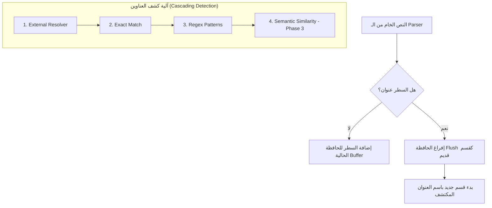

# شـرح مـلـف Section Segmenter (`section_segmenter.py`)

## 📌 نـظـرة عـامـة (Overview)
بعد أن يقوم الـ `spatial_parser` بترتيب نص الـ CV منطقياً، يأتي دور **Semantic Segmenter**. وظيفته الجوهرية هي **"تجزئة"** النص الكامل إلى بلوكات (Blocks) منفصلة بناءً على المعنى (مثلاً: جزء للخبرات، جزء للتعليم). 

هذا الموديل ليس مجرد "مقطع نصوص" بسيط، بل هو نظام **هجين (Hybrid)** يجمع بين القواعد الصلبة (Heuristics) والذكاء الاصطناعي (Semantic Embeddings) لضمان أعلى دقة في التعرف على أقسام السيرة الذاتية مهما اختلف تنسيقها.

---

## 🛠️ الـمخطط الانسيابي للمعالجة (Processing Pipeline)

---

## 🧠 الخوارزميات والتقنيات الهندسيّة (Engineering Approaches)

### 1️⃣ هرمية التصنيف المتدرج (Cascading Header Matching)
لتحقيق توازن بين السرعة (Performance) والدقة (Accuracy)، نستخدم 4 مستويات للتعرف على العناوين:
1.  **المُحلل الخارجي (Resolver):** واجهة برمجية تسمح بحقن موديلات مخصصة مستقبلاً.
2.  **المطابقة التامة (Exact Match):** فحص سريع جداً (O(1)) في قاموس العناوين القياسية (مثل `Education`).
3.  **التعبيرات النمطية (Regex):** للتعامل مع العناوين التي تحتوي على كلمات إضافية أو رموز.
4.  **التطابق الدلالي (Semantic Fallback):** إذا فشلت الطرق السابقة، يتم تحويل السطر لمتجه عددي (Vector) ومقارنته بـ "مراجع دلالية" مخزنة مسبقاً لحساب مدى قربه من معنى "الخبرة" أو "المهارات".

### 2️⃣ التطهير الهجومي (Aggressive Normalization)
السير الذاتية مليئة بالضوضاء البصرية (رموز مثل `•`, `---`, `***`). دالة `_normalize_header_candidate` تقوم بمسح كل هذه الرموز وتحويل النص لحروف صغيرة (Lowercase Alphanumeric) قبل عملية المطابقة، مما يرفع نسبة النجاح بشكل هائل.

### 3️⃣ حماية المحتوى (Bullet Point Protection)
من الأخطاء الشائعة أن يظن النظام أن جملة "I have **Skills** in Python" هي عنوان قسم مهارات جديد.
*   **الحل:** خوارزمية `_looks_like_bullet` تفحص السطر؛ فإذا كان يبدأ بنقطة ارتكاز أو ترقيم، يتم استبعاده فوراً من كونه عنواناً (Header)، ويُعامل كجزء من محتوى القسم الحالي.

---

## 🏗️ الهيكل البرمجي (Code Structure)

### 🔹 كلاسات البيانات (Dataclasses)
*   **`SectionBlock`**: يمثل المقطع الناتج، ويحتوي على النص، نسبة الثقة (Confidence)، ومكان البداية والنهاية في النص الأصلي.
*   **`SegmentationResult`**: الحزمة النهائية التي تذهب للطبقات الأعلى، وتحتوي على كل الأقسام مقسمة وجاهزة للمعالجة.

### 🔹 المحرك الأساسي `SemanticSegmenter`
يعتمد على مفهوم الـ **Buffer & Flush**:
1.  يقرأ الأسطر سطرًا سطرًا ويجمعها في "مخزن مؤقت" (Buffer).
2.  عند اكتشاف عنوان جديد، يقوم بعملية `flush()`: يأخذ ما في المخزن، يغلفه كـ `SectionBlock` للقسم القديم، ثم يصفر المخزن للبدء في القسم الجديد.
3.  في النهاية، يقوم بعمل `_merge_blocks` لدمج أي أقسام تكررت (مثل وجود مهارات في أول الـ CV وتكملتها في آخره).

---

## 🎓 نقاط القوة للمناقشة (Defense Key Points)
**عند سؤالك من قبل اللجنة عن قوة هذا الموديل، يمكنك التركيز على:**

*   **Robustness (المتانة):** النظام لا ينهار إذا كان الـ CV بدون عناوين واضحة، بل لديه (Fallback) يضع النص كله في قسم "الملخص" لضمان استمرار المعالجة.
*   **Extensibility (قابلية التوسع):** بفضل الـ `SemanticEmbedder` (Phase 3)، النظام قادر على فهم عناوين لم يراها المبرمج من قبل (مثل "Professional Journey" بدل "Experience") عن طريق فهم المعنى الرياضي للكلمة.
*   **Precision (الدقة):** استخدام تقنية الـ `y_tolerance` والـ `font-size detection` المستلمة من الـ Parser تجعل النظام يفرق بين العنوان الحقيقي وبين النص العريض (Bold) العادي.
*   **Efficiency (الكفاءة):** يتم عمل `compile` للـ Regex و `precompute` للـ Embeddings مرة واحدة فقط عند تشغيل السيرفر، مما يجعل معالجة كل CV تتم في أجزاء من الثانية.

